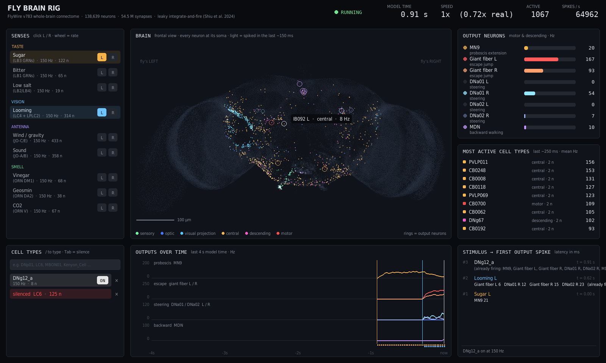
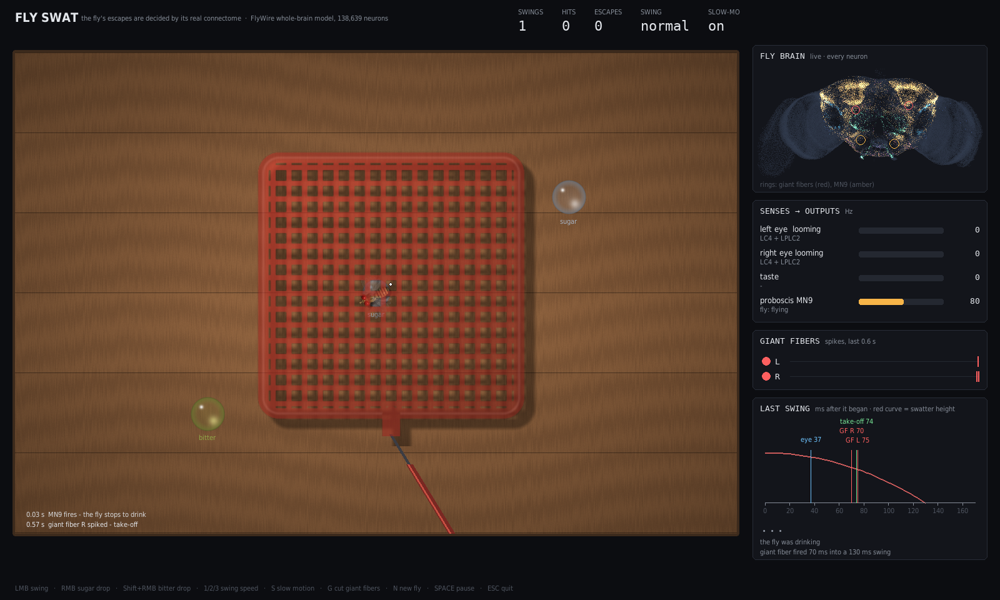
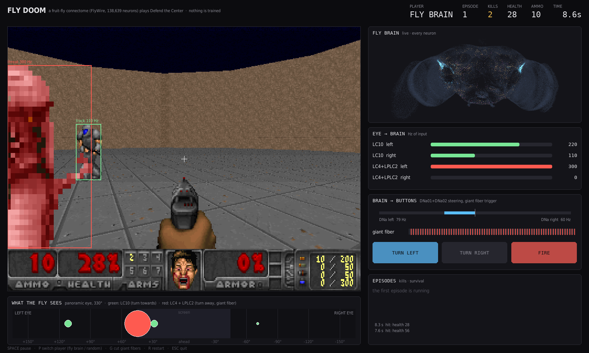

# Fly Brain Rig & Fly Swat

The whole adult fruit-fly brain, running live: all 138,639 neurons and
54.5 million synapses of the [FlyWire](https://flywire.ai) connectome (v783),
simulated as leaky integrate-and-fire neurons and stepped in real time.

Four programs use the same brain:

- **Fly Brain Rig** (`fly_console.py`): a lab console. Switch senses on and
  off (taste, looming, antenna, smell), silence any cell type, and watch
  activity spread through the brain and reach the motor and descending neurons.
- **Fly Swat** (`fly_swat.py`): try to swat a fly. The swatter's image
  expanding on the fly's eye drives its looming detectors. Whether the fly
  escapes depends on whether its giant fiber spikes in time, and that is
  decided by the connectome.
- **Fly DOOM** (`fly_doom.py`): the fly brain plays ViZDoom's "Defend the
  Center". It turns towards distant enemies, and its escape reflex pulls the
  trigger when they come close. Nothing is trained.

- **Fly Eye Cam** (`fly_cam.py`): your camera through the fly's compound
  eyes. A trained model of the retina and optic lobes (flyvis) turns the image
  into motion signals that drive the FlyWire brain; you watch its motion
  detectors, rotation-sensing cells and giant fibers react to you.





## Quick start

```bash
git clone --recursive https://github.com/snuri00/flywire-connectome-swat.git
cd flywire-connectome-swat
pip install -r requirements.txt
python3 fly_console.py              # the lab console
python3 fly_swat.py                 # the game
python3 experiments.py              # stimulus -> response experiments
python3 fly_swat.py --headless 20   # measure escape rates, no window
python3 fly_doom.py                 # the fly plays DOOM
python3 fly_doom.py --headless 10   # fly vs random and lesioned players
python3 fly_doom.py --learn 20      # 20 episodes with dopamine learning
python3 fly_cam.py                  # your camera through the fly's eyes
python3 fly_cam.py --demo loom      # the same with a synthetic looming disc
```

Fly Eye Cam also needs `data/column_assignment.csv.gz` ("Visual Neuron
Columns" from the [FlyWire Codex](https://codex.flywire.ai/api/download),
free login) and the pretrained flyvis models (`flyvis download-pretrained
--skip_large_files`).

The connectivity data come with the
[Shiu et al. model](https://github.com/philshiu/Drosophila_brain_model)
submodule. The first run downloads the FlyWire cell-type annotations
(31 MB) into `data/`. Loading the brain takes about 2 s and 1.5 GB of RAM.

## Fly Brain Rig

| Action | Effect |
|---|---|
| Click a sense's `L` / `R` chip | switch that side's sensory neurons on or off (Poisson input) |
| Click the sense's name | switch both sides |
| Mouse wheel over a sense | change its rate (25–400 Hz) |
| `/` then a cell type, `Enter` | stimulate every neuron of that type (e.g. `DNp01`, `LC6`) |
| `/`, `Tab`, cell type, `Enter` | silence that type (all its outgoing synapses set to zero) |
| Hover over the brain | name, class and rate of the nearest active neuron |
| `SPACE` / `1`–`4` | pause / model speed 0.1×, 0.25×, 0.5×, 1× |
| `C` / `R` / `E` | all senses off / reset brain state / export CSV to `recordings/` |

Panels:

- **Brain**: every neuron at its soma, frontal view. A neuron lights up in
  its class colour when it spikes and fades over ~150 ms, like a
  calcium-imaging movie. Rings mark the output neurons.
- **Output neurons**: live rate of the proboscis motor neuron MN9, the giant
  fibers, the steering neurons DNa01/DNa02 and the "moonwalker" MDN.
- **Most active cell types**: the pathway the signal is taking right now.
- **Stimulus → first output spike**: latency from switching a sense on to the
  first spike of each output. Outputs that were already firing are not counted.

## Fly Swat

| Input | Action |
|---|---|
| Mouse | aim the swatter (it hovers 14 cm above the table) |
| Left click | swing |
| Right click / Shift + right click | drop sugar water / bitter water |
| `1` `2` `3` | slow (220 ms), normal (130 ms), fast (80 ms) swing |
| `S` | slow motion during swings |
| `G` | cut the giant fibers |
| `N`, `SPACE`, `ESC` | new fly, pause, quit |

After every swing the **Last swing** panel shows a millisecond timeline: when
the eye started to report the looming swatter, when each giant fiber spiked,
when the fly took off, and when the swatter hit the table.

### What the connectome decides, and what is scripted

| Connectome (spiking model) | Scripted |
|---|---|
| **When the fly escapes**: looming drives LC4 and LPLC2 of the eye that sees the swatter; the fly takes off 6 ms after either giant fiber (DNp01) spikes | the walking path: a random walk, drawn to sugar drops within 7 cm |
| **Whether the fly feeds**: a drop under the fly drives the sugar (LB3) or bitter (LB1) taste neurons; the fly stops and drinks while MN9 fires | the direction of the jump (away from the swatter) and the flight path |
| **Bitter stops feeding**: bitter input silences MN9 | the smell of sugar is fed to the vinegar receptor neurons (ORN DM1) for display only |

The step from an expanding image to LC4/LPLC2 firing happens in the retina
and optic lobe, which the model does not simulate. It is set by hand: no
response below 3 rad/s of angular expansion, then 12 Hz per rad/s, up to 300 Hz.

## Fly DOOM

The player stands in the middle of a round room; demons and chainsaw marines
walk in from all sides. The buttons are turn left, turn right and fire.

**The fly's eye.** Each enemy has a bearing and an angular size on a
panoramic eye (330°, blind straight behind), read from the game engine. It
drives one of two groups of visual projection neurons:

| Enemy | Input | What the connectome does with it (measured) |
|---|---|---|
| small, far away | LC10a/c/d/e of that side (up to 110 Hz) | DNa01 and DNa02 on the **same** side fire: turn **towards** it |
| large, close | LC4 + LPLC2 of that side (up to 300 Hz) | DNa01 and DNa02 on the **other** side fire, and the giant fibers: turn **away**, escape |

Driving each LC type on the left side alone at 120 Hz (500 ms) sorts them
into these two groups: LC10a/c/d/e reach only the left DNa01/DNa02, while
LC4, LC6, LC17 and LPLC2 reach the right ones and the giant fibers.

**Buttons.** Turn left or right when the left and right DNa01+DNa02 rates
differ by more than 6 Hz (DNa01/DNa02 activity precedes turns to the same
side in walking flies). Fire in every game tic (28.6 ms of brain time) in
which a giant fiber spikes.

**Scores** (`fly_doom.py --headless 10`, 10 episodes each, same seeds)

| Player | Kills (mean) | Survival (mean) |
|---|---|---|
| fly brain | **3.1** | **10.3 s** |
| fly brain, LC10 silenced | 1.3 | 8.7 s |
| fly brain, giant fibers cut | 0.0 | 8.7 s |
| random buttons | 0.9 | 9.0 s |
| idle | 0.0 | 8.7 s |

Silencing LC10 takes away the turn towards distant enemies, and most kills
with it; with the giant fibers cut the fly never fires.

**Is the fly turning at random?** No, but its aim is weak. An enemy is
within ±4° of the crosshair in 13 % of game tics, against 9 % for random
buttons. The connectome steers more strongly to the left: with the same
input on both sides the left DNa fire about twice as fast, so the fly
turns left about three times as often as right and sweeps the room. Most
kills come from this sweep combined with a giant fiber that fires often.
Scaling the right side up to cancel the bias made the aim and the score
worse, so the bias is left as it is.

### Dopamine learning (`fly_learning.py`, key `L`)

A kill activates the reward dopamine neurons (PAM, 307 cells) and a hit
taken activates the punishment ones (PPL1, 16 cells) for 300 ms. Two rules
turn their spikes into synaptic change:

- **Mushroom body** (how flies learn): the enemies also drive the visual
  projection neurons of the visual Kenyon cells (distant: aMe12/aMe20; near:
  MTe30/32/40, LTe25; per side), which activate about 150 of the 5,177
  Kenyon cells. A Kenyon cell active in the 1.5 s before dopamine arrives in
  an MBON's compartment has its synapse onto that MBON depressed. The
  compartments come from the DAN→MBON synapses of the connectome. MBONs get a
  tonic 6.5 mV depolarisation so that depressing their input changes their
  firing.
- **Steering synapses** (control; no evidence that flies learn here): the
  1,413 excitatory synapses onto DNa01/DNa02 are strengthened by reward and
  weakened by punishment when their pre- and postsynaptic neurons were
  active together.

Two changes to the Shiu model were needed. The model treats dopamine as a
fast excitatory transmitter, so a reward excited thousands of Kenyon cells
and everything was unlearned at once; the dopamine neurons' fast synapses
are removed and only their spikes are used as the teaching signal. And
dopamine neurons are selected by cell class, because the FlyWire transmitter
prediction labels 5,172 of the 5,177 Kenyon cells as dopaminergic.

**Does it learn?** (`fly_doom.py --learn 20`: each condition starts from a
fresh brain and plays the same 20 games; kills per episode, mean of
episodes 1–10 → 11–20)

| Condition | Kills 1–10 | Kills 11–20 | Enemy on target | Turns left : right |
|---|---|---|---|---|
| no plasticity | 3.0 | 3.1 | 14 % | 2.8 |
| mushroom body | 2.6 | 4.2 | 14 % | 4.1 |
| steering synapses | 1.5 | 1.6 | 33 % | 0.9 |

The steering rule made things worse. The fly is hit more often than it
kills, so punishment outweighs reward, the synapses onto DNa01/DNa02 lost
19 % of their weight and the fly almost stopped turning.

The mushroom body result was repeated with three more sets of game seeds:

| Game seeds | No plasticity, 1–10 → 11–20 | Mushroom body, 1–10 → 11–20 |
|---|---|---|
| 400 | 3.0 → 3.1 | 2.6 → 4.2 |
| 500 | 3.1 → 3.0 | 2.9 → 4.1 |
| 600 | 3.6 → 3.5 | 2.5 → 3.4 |
| 700 | 1.9 → 3.1 | 4.3 → 3.4 |

In three of four runs the learning fly improves in the second half.
Pairing episodes with the same game seed, it makes 0.6 more kills per
episode than the fly without plasticity in episodes 11–20, but the
difference is not significant (paired t-test p = 0.20, n = 40). About
1,700 of the 62,261 Kenyon cell → MBON synapses end up depressed. This is
a trend, not yet a demonstration that the fly learns to play.

## Fly Eye Cam

**Why a second model for the eyes.** In the spiking whole-brain model every
synapse has the same strength and every neuron spikes. The first stages of
fly vision are graded (non-spiking) and depend on cell-type-specific time
constants; motion detection in T4/T5 needs them. flyvis (Lappalainen et al.,
Nature 2024) keeps the optic lobe connectome fixed and trains exactly these
parameters on optic flow; its T4/T5 cells reproduce the direction tuning
measured in flies. Checked here with gratings on 721 ommatidia: rightward
motion drives T4b, leftward T4a, downward T4c, upward T5d.

**Joining the two models.** The camera image is split in two (left half: left
eye). Each half is resampled onto 721 hexagonal ommatidia and run through
flyvis on the GPU (1 s of vision takes 0.13 s). Its lobula and lobula plate
output types (T2, T3, T4a-d, T5a-d, Tm, TmY: 17 types) drive the same types
in the FlyWire brain, 16,002 neurons, by Poisson input. Each FlyWire neuron's
column comes from the Codex column assignment (Matsliah et al., Nature 2024).
The two hexagonal lattices were aligned from the connectome: for every T4
subtype the offset from its Mi4 to its Mi9 inputs points along its preferred
direction in both models, and a 180° rotation makes all four agree (mean
cosine 0.97–0.98 in either eye; the next best candidate 0.55). Tonic cell
types adapt with a 0.5 s time constant so that a still scene fades out.

**What comes out** (synthetic movies, 0.8 s each; Hz)

| Stimulus | HS left / right | H2 left / right | Giant fiber |
|---|---|---|---|
| grey screen | 0 / 0 | 0 / 0 | 0 |
| world moving right | 122 / 236 | 219 / 4 | 45–65 |
| world moving left | 219 / 70 | 4 / 225 | 48–76 |
| dark disc looming on the right | 24 / 79 | 0 / 0 | 56 |

HS cells are excited by front-to-back motion in their own eye and H2 cells
by back-to-front motion, mirror-symmetrically, as in the fly. Where it falls
short is the central brain: LPLC2, the main looming detector, barely
responds, the giant fiber also fires for large moving gratings, and the
steering neurons turn against the direction of a rotating world instead of
with it (the optomotor response).

## How it works

### Brain (`fly_brain.py`)

The neuron model, its constants and the synapse rule are those of
Shiu et al. 2024, *Nature* 634, 210–219:

    dv/dt = (v_0 - v + g) / t_mbr        v_0 = -52 mV, t_mbr = 20 ms
    dg/dt = -g / tau                      tau = 5 ms

A spike (v > -45 mV) resets v and g and makes the neuron refractory for
2.2 ms. After 1.8 ms each spike adds 0.275 mV × (signed synapse count) to the
g of every postsynaptic neuron. The sign comes from the predicted
neurotransmitter: acetylcholine excites, GABA and glutamate inhibit.

The paper runs whole trials in Brian2. Here the same model is written as
two numba loops over a sparse (CSR) weight matrix, so it can be stepped
0.1 ms at a time inside a game loop. It runs at about 0.9× real time on one
CPU core.

### Validation against the published model

Fed the same deterministic input as the original Brian2 code, the
reimplementation produces the **same 2,798 spikes, in the same neurons, at
the same time steps**. With Poisson input (sugar neurons at 100 Hz, 16 trials
each), the per-neuron firing rates correlate at r = 0.9994.

Getting there required one detail that is not in the paper: in Brian2,
synaptic input that reaches a neuron while it is refractory is **lost**
(the variables are marked "unless refractory"). A first version that kept
this input produced 18 % more spikes, and up to twice the rate in strongly
recurrent motor circuits.

## Measured behaviour

**Console experiments** (`experiments.py`; 5 trials × 1 s, inputs at 150 Hz)

| Stimulus | Result |
|---|---|
| none | no neuron fires; the model has no spontaneous activity |
| sugar neurons (LB3, left) | MN9 89 Hz: proboscis extension |
| sugar + bitter | MN9 7.7 Hz: bitter suppresses feeding |
| bitter alone | MN9 0 Hz |
| looming, left eye (LC4 + LPLC2) | giant fiber left 168 Hz, right 109 Hz; DNa01 right 41 Hz |
| looming, both eyes | both giant fibers 176–192 Hz |
| looming, both eyes, LC4 silenced | giant fibers still 150–170 Hz: LPLC2 alone is enough |
| antennal JO-C/E, left | descending neurons DNbe001, DNp18, DNge091 …; no steering or MDN activity |

**Giant-fiber latency** to a looming ramp on the left eye (first spike, ms)

| Ramp to peak | 50 Hz peak | 100 Hz peak | 200 Hz peak |
|---|---|---|---|
| 50 ms | 25–40 | 20–25 | 15 |
| 150 ms | 30–65 | 25–55 | 20–35 |
| 400 ms | 85–140 | 70–95 | 30–65 |

While the fly drinks sugar, the same 150 ms / 100 Hz ramp needs 95–120 ms.
Feeding delaying escape is not programmed anywhere: it comes out of the
connectome.

**Fly Swat** (`fly_swat.py --headless 20`; swatter aimed at the fly with a 15 mm aim error)

| Condition | Hit | Giant fiber, first spike (median) |
|---|---|---|
| walking fly, normal swing (130 ms) | 11 / 20 | 48 ms |
| drinking fly, normal swing | 13 / 20 | 70 ms |
| walking fly, fast swing (80 ms) | 16 / 20 | 25 ms |
| walking fly, slow swing (220 ms) | 2 / 20 | 102 ms |
| giant fibers cut, normal swing | 20 / 20 | 48 ms (spikes, but cannot jump) |

A drinking fly's giant fiber fires about 20 ms later, and the fly is hit more
often. A slow swing is seen coming; a fast one leaves too little time.

## Limitations

- Only the brain is modelled. The ventral nerve cord (which turns descending
  commands into leg and wing movements) is not, so walking, the jump direction
  and flight are scripted.
- The model has no spontaneous activity; without input the brain is silent.
- No walking command emerged from the stimuli tried so far: MDN stays nearly
  silent.
- The retina and early optic lobe are not simulated; looming enters at LC4/LPLC2
  through a hand-set mapping.
- No plasticity, neuromodulation or gap junctions; neuron parameters are the
  same for every cell.
- The `side` of each neuron is taken from the FlyWire annotations; whether it
  is the fly's left or the left of the image volume has not been checked.
- In Fly DOOM the eye reads enemy positions from the engine, not pixels, and
  the brain runs at about half of DOOM's speed (the game waits for it).
- Learning changes the brain model in two ways (dopamine neurons have no fast
  synapses; MBONs get a tonic depolarisation), and its effect on the DOOM
  score is not yet statistically significant.
- Fly Eye Cam runs the brain at about 0.4× real time. Its eyes are trained,
  the central brain is not, so looming and optomotor responses are weak or
  wrong (see above).
- Real time is reached only just (≈0.9× on one core); the game shows the
  brain's clock.

## Files

| File | Purpose |
|---|---|
| `fly_brain.py` | connectome loader and integrate-and-fire network (numba); run it for a short demo |
| `fly_circuits.py` | named sensory inputs and motor/descending outputs (by cell type) |
| `brain_view.py` | live picture of all neurons at their soma positions |
| `fly_console.py` | Fly Brain Rig console (pygame) |
| `fly_sprite.py` | fly, swatter and drop sprites, rendered at start-up from shaded distance fields |
| `swat_world.py` | the swatting world: fly, swatter, drops, looming, brain loop |
| `fly_swat.py` | Fly Swat game (pygame) and headless benchmark |
| `doom_world.py` | ViZDoom environment, panoramic eye, brain → buttons |
| `fly_learning.py` | dopamine-gated plasticity: mushroom body and steering-synapse rules |
| `fly_doom.py` | Fly DOOM viewer (pygame), headless benchmark and learning experiment |
| `fly_eye.py` | compound eyes: camera image → flyvis retina and optic lobe → FlyWire neurons |
| `fly_cam.py` | Fly Eye Cam (pygame): camera, eye mosaics, motion map, brain readouts |
| `experiments.py` | stimulus → response experiments from the command line |
| `Drosophila_brain_model/` | Shiu et al. model (git submodule): connectivity data, Brian2 reference |

## Credits

- Retina and optic lobe model: Lappalainen et al., *Nature* 634, 1132–1140 (2024) (flyvis).
- Visual columns: Matsliah et al., *Nature* 634, 166–180 (2024).
- Connectome: FlyWire Consortium, Dorkenwald et al., *Nature* 634, 124–138 (2024).
- Cell types and annotations: Schlegel et al., *Nature* 634, 139–152 (2024).
- Neurotransmitter predictions: Eckstein et al., *Cell* 187, 2574–2594 (2024).
- Whole-brain LIF model, parameters and data files: Shiu et al., *Nature* 634, 210–219 (2024).
- Looming detection and the giant fiber: von Reyn et al., *Nat. Neurosci.* 17, 962–970 (2014);
  Ache et al., *Curr. Biol.* 29, 1073–1081 (2019).
